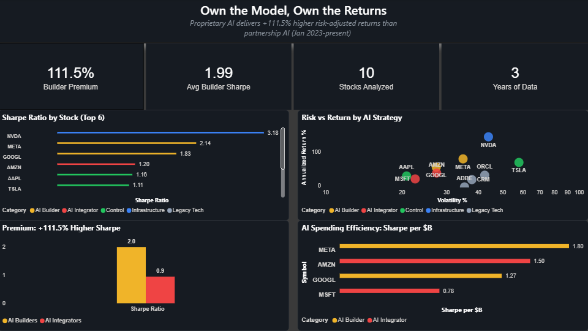
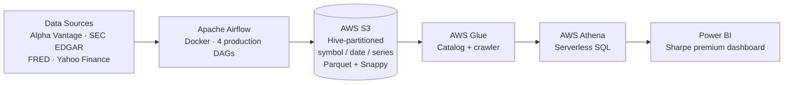

# Own the Model, Own the Returns

[](https://github.com/ericg1212/sharpe-premium-pipeline/actions/workflows/ci.yml)
[](https://github.com/ericg1212/sharpe-premium-pipeline/actions/workflows/codeql.yml)
[](https://github.com/ericg1212/sharpe-premium-pipeline/releases)


**By [Eric Grynspan](https://www.linkedin.com/in/ericgrynspan/)** &nbsp;·&nbsp; [ericg1212.github.io](https://ericg1212.github.io)

---

$650B in AI spend forecast for 2026 across Big Tech. The companies spending the most aren't earning the most — the premium flows to builders. This pipeline quantifies that relationship: a **+92.0% Sharpe ratio premium** for proprietary AI builders over third-party integrators (Spearman ρ = +0.800, p ≈ 0.005), derived from four production Airflow pipelines ingesting market prices, SEC 10-K filings, and FRED macro indicators.

## Builders Outperform Renters by 92%

Analysis of risk-adjusted returns (Jan 2023 – Q1 2026) across 10 major tech stocks reveals a clear **AI value chain hierarchy** in Sharpe ratios:

| Tier | Companies | Avg Sharpe | AI Strategy |
|------|-----------|-----------|-------------|
| Infrastructure | NVDA | 2.910 | Sells the GPUs |
| **AI Builders** | META, GOOGL | **1.772** | Proprietary AI (Llama, Gemini, custom chips) |
| AI Integrators | MSFT, AMZN | 0.923 | Third-party partnerships (OpenAI, Anthropic) |
| Control | AAPL, TSLA | 1.040 | Mixed AI exposure |
| Legacy Tech | CRM, ORCL, ADBE | 0.273 | Traditional software |

**Builder Premium: +92.0%** — Companies building proprietary AI outperform those renting it through partnerships by 92% on risk-adjusted returns. Confirmed Q1 2026 — narrowed from the peak through a software sector correction, but direction held.

Spearman rank correlation between AI% of capex and Sharpe ratio: **ρ = +0.800** (t ≈ 3.77, p ≈ 0.005) — statistically significant at the 0.01 level. A universe of every major AI builder and integrator at scale — the premium holds stock by stock, not just in aggregate.

Analysis frozen at Q1 2026 — confirmed through a software sector correction and elevated macro volatility.

### Does the Premium Hold Through Rate Cycles?

Each month classified by FRED regime (GS10 vs. rolling mean, CPI YoY vs. 4%, UNRATE vs. 5.5%). Premium is positive in 36 of 62 months — strongest when monetary conditions normalize.

| Regime | Avg Builder Premium | Months |
|--------|-------------------|--------|
| Falling rates, normal inflation | +0.502 | 12 |
| Rising rates, normal inflation | +0.454 | 21 |
| Rising rates, high inflation, elevated unemployment | +0.175 | 3 |
| Rising rates, normal inflation, elevated unemployment | -0.370 | 3 |
| Rising rates, high inflation | -0.481 | 23 |

The negative regimes (23 months) reflect the 2022–2023 Fed tightening cycle — broad growth multiple compression, not an AI-specific signal. The **+92.0% is a through-the-cycle figure** across both compression and recovery.



## Architecture


```mermaid
flowchart LR
    A["Data Sources<br/>Alpha Vantage · SEC EDGAR<br/>FRED · Yahoo Finance"] --> B["Apache Airflow<br/>Docker · 4 production DAGs"]
    B --> C[("AWS S3<br/>Hive-partitioned<br/>symbol / date / series<br/>Parquet + Snappy")]
    C --> D["AWS Glue<br/>Catalog + crawler"]
    D --> E["AWS Athena<br/>Serverless SQL"]
    E --> F["Power BI<br/>Sharpe premium dashboard"]
```

## Pipelines

### Stock Pipeline (`stock_pipeline/stock_pipeline.py`)
Daily prices for the 10-stock universe — the raw input for Sharpe ratio calculation across every tier of the AI value chain.
- **Stocks:** NVDA, MSFT, GOOGL, AMZN, META, CRM, ORCL, ADBE, AAPL, TSLA
- **Source:** Alpha Vantage API (Global Quote)
- **Schedule:** 5 PM ET Mon-Fri (after market close)
- **S3 path:** `stocks/date={date}/{timestamp}.parquet`

### SEC EDGAR Pipeline (`edgar_pipeline/edgar_pipeline.py`)
Authoritative capex from 10-K filings — what companies actually reported to regulators, not what they told analysts. The basis for capex efficiency calculations and the AI% of spend metric that drives the Spearman correlation.
- **Source:** SEC EDGAR Company Facts API (free, no auth beyond User-Agent header)
- **Data:** Annual capex + revenue from 10-K filings for META, GOOGL, MSFT, AMZN
- **Schedule:** Quarterly (Jan/Apr/Jul/Oct 1) — picks up each company's 10-K within 3 months
- **S3 path:** `fundamentals/cik={cik}/year={year}/data.parquet`
- Rate-limit aware: 1-second sleep between company fetches (SEC 10 req/sec limit)

### FRED Macro Pipeline (`fred_pipeline/fred_pipeline.py`)
Macro regime classification — rates, inflation, and unemployment from the St. Louis Fed to answer whether the builder premium holds across monetary cycles, not just in calm conditions.
- **Source:** St. Louis Fed FRED API (free, API key required)
- **Series:** GS10 (10-yr Treasury), CPIAUCSL (CPI), UNRATE (unemployment), FEDFUNDS (fed funds rate)
- **Schedule:** 1st of every month (FRED releases with ~2-week lag)
- **S3 path:** `macro_indicators/series={series_id}/year={year}/data.parquet`

### Analysis Pipeline (`analysis_pipeline/analysis_pipeline.py`)
Closes the loop — recomputes the builder premium automatically after each market close so the finding stays current without manual runs.
- **Schedule:** 5:30 PM Mon-Fri (30 min after stock pipeline)

### Monitor (`monitoring/pipeline_monitor.py`)
Schedule-aware health checks across all pipelines — staleness thresholds vary by source cadence (daily/monthly/quarterly), with succeeded/failed symbol lists for targeted backfill.

## Historical Backtest (`stock_pipeline/historical_backtest.py`)

Pulls 3 years of monthly adjusted close prices and calculates:
- Annualized return, volatility, and Sharpe ratio per stock
- Category-level averages across the AI value chain
- Build vs. Rent premium (proprietary AI vs. partnership AI)
- Capex efficiency (Sharpe per $B of AI spend, from SEC EDGAR + earnings guidance)
- Spearman rank correlation between AI% of capex and Sharpe ratio

## Design Decisions

| Decision | Why |
|---|---|
| **Parquet + Snappy on S3** | Columnar format for Athena pushdown; Snappy balances compression ratio and query speed for time-series financial data |
| **Hive-style S3 partitions** | `symbol/date/series` partitioning lets Athena prune entire partitions — avoids full-bucket scans on daily queries |
| **Spearman over Pearson** | Sharpe ratios and capex percentages aren't normally distributed. Spearman rank correlation is the right test for monotonic relationships on financial data |
| **SEC EDGAR over earnings calls** | 10-K capex figures are audited and filed with regulators — not what companies told analysts. Authoritative source for the AI% of spend metric |
| **moto for AWS mocks** | Mocks at the HTTP layer, not the SDK layer — tests exercise the same code path that runs in production; no real AWS calls in CI |
| **CeleryExecutor** | Parallel DAG execution across the 4 pipelines; LocalExecutor would serialize them on the same worker |
| **Airflow 2.x pinned** | 3.x is a breaking provider-line rewrite, not a version bump. Advisories with 3.x-only fixes are triaged individually in CI (pip-audit ignore list, each documented) — the right call for a single-user local deployment; revisit at the next major platform change |

## Stack

| Layer | Technology | Role |
|---|---|---|
| Orchestration | Apache Airflow 2.10.4 (CeleryExecutor) | Parallel DAG execution across the 4 pipelines |
| Infrastructure | Docker Compose (6 containers, PostgreSQL 16) | One-command local Airflow deployment |
| Storage | AWS S3 (Parquet/Snappy, Hive-style partitions) | Columnar lake — Athena prunes partitions instead of scanning the bucket |
| Query Engine | AWS Athena (Presto SQL) | Serverless SQL directly over S3 |
| Visualization | Power BI | Premium + rate-cycle dashboards |
| IaC | Terraform | Reproducible AWS provisioning |
| CI/CD | GitHub Actions (lint, bandit, pip-audit, pytest, checkov) | Quality + security gates on every push |
| Language | Python 3.12 | All pipeline and analysis code |
| Key Libraries | boto3, pandas, numpy, pyarrow, requests | AWS SDK, transforms, Parquet I/O, API clients |
| Testing | pytest + moto (184 tests, AWS mocked at HTTP layer) | CI exercises the production code path with zero AWS calls |

## Data Sources

| Source | API | Data | Rate Limit |
|--------|-----|------|-----------|
| [Alpha Vantage](https://www.alphavantage.co/) | Stock quotes + monthly history | Daily prices | 25 calls/day (free) |
| [SEC EDGAR](https://www.sec.gov/developer) | Company Facts API | Annual 10-K filings | No limit (free) |
| [FRED](https://fred.stlouisfed.org/docs/api/fred/) | Observations API | Macro indicators | No limit (free, key required) |

---

## Infrastructure as Code

AWS resources defined in Terraform under `terraform/`:
- **S3 bucket** — data lake for all pipelines
- **Glue catalog database + tables** — schema definitions for Athena queries
- **Athena workgroup** — query engine with S3 results location

```bash
cd terraform
terraform init
terraform validate   # Verify configuration
terraform plan       # Preview resources (no changes applied)
```

## Testing

184 tests across all pipelines, using moto to mock AWS at the HTTP layer — no real AWS calls in CI.

```bash
pytest tests/ -v        # Run all 184 tests
pytest tests/test_edgar_pipeline.py -v   # Single pipeline
make lint               # flake8 across all source dirs
```

| Test File | Tests | Coverage |
|-----------|-------|---------|
| test_utils.py | 27 | s3_read/write_json/ndjson/parquet, Athena client, register partition |
| test_data_quality.py | 18 | validation rules |
| test_edgar_pipeline.py | 19 | extract helper, transform, load (Parquet) |
| test_historical_backtest.py | 16 | Sharpe ratio, category averages, build vs rent |
| test_finance_utils.py | 16 | annualized return, drawdown, beta, rolling Sharpe |
| test_portfolio_analysis.py | 17 | portfolio metrics, capex efficiency |
| test_macro_regime_analysis.py | 14 | regime classification, builder premium by macro regime |
| test_fred_pipeline.py | 14 | transform + load (Parquet) |
| test_stock_pipeline.py | 13 | transform + load (Parquet) |
| test_historical_backfill.py | 11 | format (list of dicts), write (Parquet), register |
| test_sharpe_calculation.py | 10 | Sharpe math |
| test_analysis_pipeline.py | 6 | DAG structure |
| test_integration.py | 3 | end-to-end pipeline integration |

## Security

| Layer | Controls |
|---|---|
| Credentials | Environment variables only — AWS keys + API keys injected via Docker Compose `.env`, never hardcoded |
| CI/CD | bandit (static analysis) · pip-audit (CVE scan) · checkov (Terraform IaC scan) on every push |
| Repo | Branch protection · secret scanning + push protection · Dependabot · pre-commit hooks · `SECURITY.md` |

## Project Structure

```
data-engineering-portfolio/
├── config.py                          # Central constants (symbols, S3 bucket, FRED series, EDGAR CIKs)
├── stock_pipeline/
│   ├── stock_pipeline.py              # Airflow DAG: 10-stock daily ingestion
│   ├── historical_backtest.py         # 3-year Sharpe ratio analysis
│   ├── historical_backfill.py         # One-time S3 backfill script (Parquet output)
│   ├── portfolio_analysis.py          # Build vs Rent + capex efficiency CSVs
│   ├── finance_utils.py               # Pure finance functions: Sharpe, drawdown, beta
│   ├── macro_regime_analysis.py       # Regime classification + builder premium by macro regime
│   └── *.csv / *.json                 # Power BI data files
├── edgar_pipeline/
│   └── edgar_pipeline.py             # Airflow DAG: SEC 10-K capex + revenue
├── fred_pipeline/
│   └── fred_pipeline.py              # Airflow DAG: FRED macro indicators
├── analysis_pipeline/
│   └── analysis_pipeline.py          # Airflow DAG: automated backtest trigger
├── monitoring/
│   ├── pipeline_monitor.py           # Airflow DAG: health checks
│   └── data_quality.py               # Validation functions
├── tests/
│   ├── conftest.py                   # Shared moto S3/Athena fixtures + Airflow stubs
│   ├── test_utils.py                 # 27 tests for shared utils helpers
│   ├── test_finance_utils.py         # 16 tests for finance math functions
│   ├── test_stock_pipeline.py
│   ├── test_edgar_pipeline.py
│   ├── test_fred_pipeline.py
│   ├── test_historical_backfill.py
│   ├── test_historical_backtest.py
│   ├── test_analysis_pipeline.py
│   ├── test_macro_regime_analysis.py
│   ├── test_sharpe_calculation.py
│   ├── test_data_quality.py
│   ├── test_portfolio_analysis.py
│   └── test_integration.py
├── queries/
│   └── sample_queries.sql            # Athena SQL showcase queries
├── terraform/
│   ├── main.tf                       # S3, Glue, Athena resource definitions
│   ├── variables.tf
│   └── outputs.tf
├── docker-compose.yaml               # Airflow cluster (6 containers)
├── Makefile                          # make up/down/test/lint/analyze/demo
├── LICENSE                           # MIT
├── .github/workflows/ci.yml          # CI: lint, pytest, bandit, pip-audit, checkov, terraform fmt
├── .env.example                      # Credential template
└── README.md
```

## Setup

### Prerequisites
- Docker Desktop
- Python 3.12+
- AWS account (S3, Athena, Glue)
- API keys: Alpha Vantage, FRED (free at fred.stlouisfed.org/docs/api/api_key.html)

### Quick Start
```bash
# 1. Clone the repo
git clone https://github.com/ericg1212/sharpe-premium-pipeline.git
cd sharpe-premium-pipeline

# 2. Create .env file with your credentials
cp .env.example .env
# Edit .env with your API keys and AWS credentials

# 3. Start Airflow
docker compose up -d

# 4. Access Airflow UI
# http://localhost:8090 (airflow/airflow)

# 5. Run the historical backtest + portfolio analysis
make analyze
```

### Makefile Commands
```bash
make setup    # Create .env from template
make up       # Start Airflow stack
make down     # Stop Airflow stack
make test     # Run pytest
make lint     # flake8 across all source dirs
make analyze  # Run backtest + portfolio analysis, refresh all CSVs
make demo     # Run full analysis in local mode (no AWS required)
make logs     # Tail scheduler + worker logs
make clean    # Remove __pycache__, logs, stopped containers
```

## Author

**Eric Grynspan** — Data Engineer · Financial Services & Healthcare

[](https://www.linkedin.com/in/ericgrynspan/)
